  

# 🛡️ Awesome Dynamic Application Security Testing (DAST) 

  
  
  

> **A curated, SEO-optimized list of top Dynamic Application Security Testing (DAST) SaaS platforms, open-source vulnerability scanners, runtime security tools, and DevSecOps integrations.**

---

## 💡 Overview & Market Landscape

The global **Dynamic Application Security Testing (DAST)** market is a critical pillar of Application Security Testing (AST), valued at approximately **\$1.44 Billion USD** (growing at ~26.7% CAGR). 

The sector is **moderately fragmented**: 
- **Enterprise Heavyweights & Conglomerates** (e.g., HCLTech, Veracode, Checkmarx, Invicti) control large enterprise compliance and legacy application security budgets.
- **Developer-Centric & Niche Innovators** (e.g., StackHawk, Detectify, Probely, Intruder) captured fast-growing mid-market and CI/CD pipeline automation segments.
- **Open-Source Standard Bearers** (e.g., OWASP ZAP, Nuclei, SQLmap) drive vendor-independent security auditing across global security research and engineering teams.

---

## 📋 Table of Contents

- [🏢 SaaS & Hosted DAST Platforms](#-saas--hosted-dast-platforms)
- [🔓 Open-Source GitHub Projects](#-open-source-github-projects)
- [🛠️ Additional Specialized Options](#️-additional-specialized-options)
- [🤝 How to Contribute](#-how-to-contribute)
- [💖 Support & Sponsorship](#-support--sponsorship)
- [📈 Star History](#-star-history)
- [⚠️ Disclaimer](#️-disclaimer)

---

## 🏢 SaaS & Hosted DAST Platforms

Below is a comparative breakdown of commercial DAST SaaS solutions, sorted by **Company Size / Revenue / Valuation** (descending).

| SaaS Platform | Company Size / Valuation / Revenue | Starting Pricing | Free Tier / Free Trial Limit | Core DAST Strengths |
| :--- | :--- | :--- | :--- | :--- |
| **[HCL AppScan](https://www.hcltechsw.com/appscan)** | **~$13.3 Billion** *(HCLTech Enterprise)* | ~$2,500 / year (Custom Enterprise quote) | 30-Day Free Trial (Full DAST evaluation) | Enterprise AppSec suite for complex web applications and legacy API portfolios. |
| **[Veracode DAST](https://www.veracode.com/)** | **~$2.5 Billion** *(Valuation / TA Associates)* | ~$10,000 / year (Base module quote) | 14-Day Free Trial / Custom Enterprise POC | Integrated cloud DAST platform with unified SAST, SCA, and compliance analytics. |
| **[Checkmarx DAST](https://checkmarx.com/)** | **~$1.15 Billion** *(Acquired by Hellman & Friedman)* | ~$8,000 / year (Custom Enterprise quote) | Guided Enterprise Demo (No self-serve trial) | Scalable enterprise scanner built around checkmarx AppSec platform & ZAP engine. |
| **[Rapid7 InsightAppSec](https://www.rapid7.com/products/insightappsec/)** | **~$2.0 Billion** *(Public: RPD)* | ~$2,000 / app / year | 30-Day Free Trial | Automated attack simulation and continuous cloud vulnerability scanning. |
| **[Invicti](https://www.invicti.com/)** | **~$1.0 Billion** *(Valuation / ~$100M+ ARR)* | ~$7,000 / year | 14-Day Enterprise Demo / Trial on Request | Proof-based scanning eliminating false positives with interactive login recorder. |
| **[Detectify](https://detectify.com/)** | **~$85M Valuation** stroke="white" (~$15M ARR) | $85 / month (Surface plan) | 14-Day Free Trial (Unlimited external surface mapping) | Continuous external attack surface monitoring and automated payload scanning. |
| **[StackHawk](https://www.stackhawk.com/)** | **~$50.2M Raised** (~$5M ARR) | $39 / contributor / month | 14-Day Free Trial (Includes 10 cloud scan hours) | Developer-first API scanning with REST, GraphQL, JSON-RPC & CI/CD pipeline focus. |
| **[Probely](https://probely.com/)** | **~$12M Raised** (Acquired by Snyk) | €49 / month | 14-Day Free Trial (Full vulnerability scanner features) | API-first web scanner with actionable developer remediation guides & Jira sync. |
| **[Burp Suite Enterprise](https://portswigger.net/burp/enterprise)** | **~$35M ARR** *(PortSwigger Private)* | $475 / user / year (Pro) / $6,360/yr (Enterprise) | 14-Day Free Trial (Burp Suite Enterprise Agent) | Industry standard penetration testing scanner engine scaled for scheduled CI/CD scans. |
| **[Intruder](https://www.intruder.io/)** | **~$2.5M ARR** | $113 / month | Free Tier Available (Limited Exposure) / 14-Day Full Trial | Automated cloud perimeter scanning and attack surface vulnerability management. |
| **[Acunetix](https://www.acunetix.com/)** | **Part of Invicti Group** | ~$4,500 / year | 14-Day Demo / Trial on Request | Advanced multi-step authentication scanning with built-in OWASP Top 10 policies. |

---

## 🔓 Open-Source GitHub Projects

Curated open-source DAST tools, active scanners, and specialized security frameworks. Sorted by **GitHub Star Count** (descending).

| Project & Repo | Star Count | Primary Focus & Features | License |
| :--- | :--- | :--- | :--- |
| **[sqlmap](https://github.com/sqlmapproject/sqlmap)** |  | Automated SQL injection detection, database takeover, and dynamic payload adaptation engine. | GPL-2.0 |
| **[Nuclei](https://github.com/projectdiscovery/nuclei)** |  | Fast, template-driven vulnerability scanner for web apps, APIs, DNS, and headless browser checks. | MIT |
| **[OWASP ZAP](https://github.com/zaproxy/zaproxy)** |  | De-facto open-source DAST proxy & vulnerability scanner with active/passive checks, OpenAPI & GraphQL support. | Apache-2.0 |
| **[Nikto](https://github.com/sullo/nikto)** |  | Command-line web server scanner checking for dangerous CGIs, outdated software, and misconfigurations. | GPL-3.0 |
| **[XSStrike](https://github.com/s0md3v/XSStrike)** |  | Advanced XSS detection suite with payload generator, DOM parser, and intelligent fuzzing engine. | GPL-3.0 |
| **[WPScan](https://github.com/wpscanteam/wpscan)** |  | Black-box WordPress security scanner enumerating plugins, themes, and known core vulnerabilities. | Custom / Non-Comm |
| **[Dalfox](https://github.com/hahwul/dalfox)** |  | Fast parameter analysis and XSS scanner written in Go with MCP server for AI agent integrations. | MIT |
| **[Wapiti](https://github.com/wapiti-scanner/wapiti)** |  | Black-box web scanner auditing forms, scripts, payload injections, and passive traffic analysis. | GPL-3.0 |
| **[DORM](https://github.com/MrEx-Right/DORM)** |  | Concurrent Go-based DAST scanner featuring active fuzzing proxy, NIST CVE correlation, and LLM scans. | AGPL-3.0 |
| **[Gung12](https://github.com/DenReanin/gung12)** |  | OWASP-aligned web form DAST scanner with Playwright SPA support, blind injection confirmation, and SARIF output. | MIT |
| **[justdastit](https://github.com/SnailSploit/justdastit)** |  | Interactive CLI DAST toolkit with active/passive checks, repeater, intercepting proxy, and HTML reports. | MIT |
| **[ProofCMS](https://github.com/pxawtyy/proofcms)** |  | Modular CMS vulnerability detector for WordPress and Joomla with evidence-based verification. | MIT |

---

## 🛠️ Additional Specialized Options

- **Arachni** — *[Legacy]* Modular web scanner; project is end-of-life (use OWASP ZAP or Wapiti).
- **OpenVAS** — Network and host-level vulnerability scanner (complements web DAST).
- **Lonkero** — High-performance Rust scanner focused on false-positive reduction.
- **Nmap** — Network mapper for host discovery and service version fingerprinting.
- **w3af** — Web application attack and audit framework.

---

## 🤝 How to Contribute

1. Fork this repository 🍴
2. Add your DAST tool or open-source scanner to `README.md` following the tabular format.
3. Ensure accurate pricing details, free tier limits, star counts, or company metrics are included.
4. Open a Pull Request (PR) with a brief summary of the changes.

---

## 💖 Support & Sponsorship

If you find this DAST resource list helpful in securing your application stack, please consider supporting the project!

- ⭐ **Star** this repository to help others discover it.
- 🔀 **Fork** and contribute new tools or updates.
- 📢 **Share** with your DevSecOps, AppSec, and Cybersecurity colleagues.
- ☕ **Buy me a coffee / Sponsor**: Support ongoing maintenance via [GitHub Sponsors](https://github.com/sponsors/ishandutta2007).

---

## 📈 Star History

---

## ⚠️ Disclaimer

- This is a **community-curated** list for educational, security auditing, and research purposes.
- DAST tools must strictly be executed against web applications and infrastructure you own or have explicit authorization to test. Unauthorized penetration testing or scanning is illegal.
- Automated security scanners may produce false positives or false negatives; manual validation by AppSec professionals is recommended.

---

  <b>Built for Security Engineers, DevSecOps Teams, Penetration Testers, and AppSec Professionals worldwide.</b>

